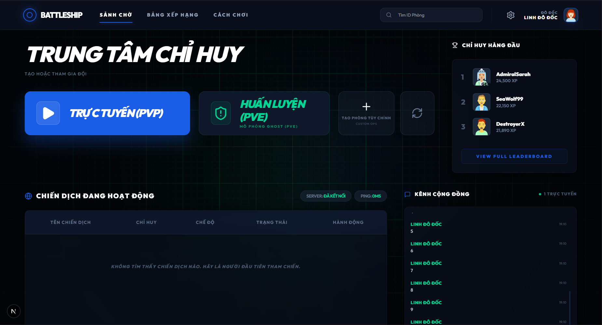

# ⚓ Battleship Command - Premium Tactical Combat

**Battleship Command** mang trò chơi Bắn thuyền kinh điển lên một tầm cao mới với trải nghiệm hiện đại, hỗ trợ đấu Online (PvP) và đấu với máy (PvE). Đồ họa tinh tế, âm thanh sống động và tính chiến thuật chuyên sâu.

[**Trải nghiệm Demo ngay 🚀**](https://battleship-command.vercel.app/)

---

## 📸 Hình Ảnh Minh Họa

| Sảnh Chờ (Lobby) | Dàn Trận (Setup) | Chiến Đấu (Battle) |
| :--- | :--- | :--- |
|  |  |  |

---

## Tính Năng Nổi Bật

* **Chế độ chơi đa dạng**:
    * **PvP Online**: Thách đấu người chơi khác trong thời gian thực qua Socket.io.
    * **PvE**: Rèn luyện kỹ năng với AI.
* **Chiến thuật chuyên sâu**:
    * Tự do dàn trận, xoay tàu.
    * Tính năng **Auto-deploy** giúp triển khai đội hình nhanh chóng.
* **Trải nghiệm người dùng (UX)**:
    * Giao diện **Dark Mode** hiện đại, huyền bí.
    * Hiệu ứng chuyển động mượt mà với Framer Motion.
    * Hỗ trợ rung (Haptic feedback) và âm thanh chiến đấu sống động.
* **📱 Responsive**: Tối ưu hoàn hảo cho cả PC và Mobile.

## Star History

## Đường dẫn trang web demo

https://battleship-command.vercel.app/

---

Phát triển bởi **linh0526** with ❤️ 
